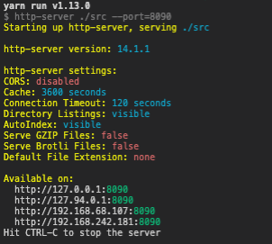
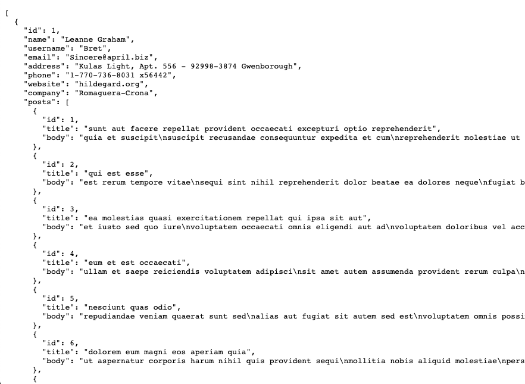
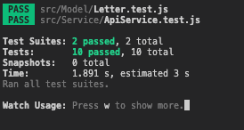
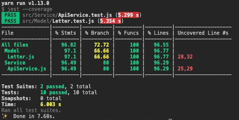

## Description
This app, is a simple Vanilla JS application that manage the get request from an API and format it using a javascript structure with HTML to rend 

## Requirements

* Node 14.x installed;

## Get Started
Follow the steps below:

1. At the terminal run: `npm install` or `yarn`;
2. And: `npm run serve` or `yarn serve`;
	

3. Check your browser:
	

## Tests
To run the test you need just run the command `npm run test` or `yarn test`.
	

	
You can also run `npm run test-coverage` or `yarn test-coverage`.
	

## Pre-commit
We're using husky to run eslint and our unit tests in each commit, if it's not correct the commit is blocked.

